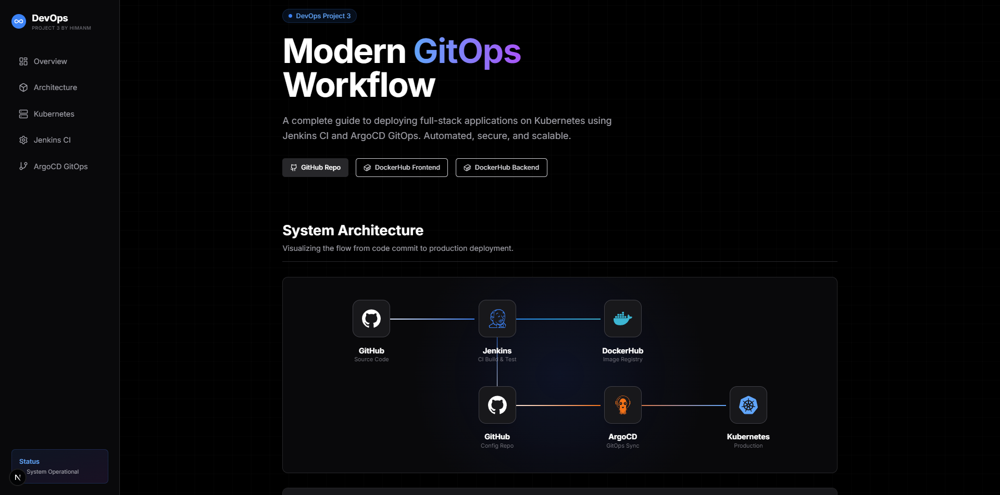
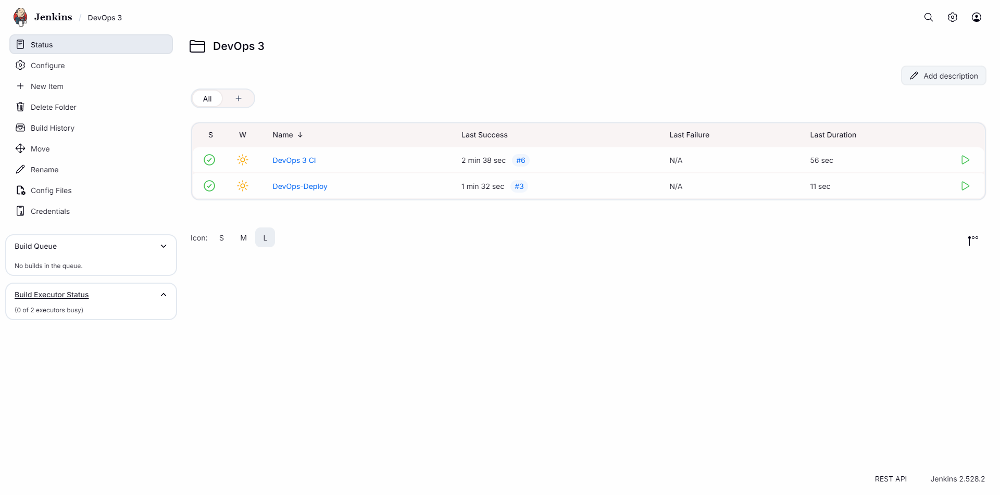
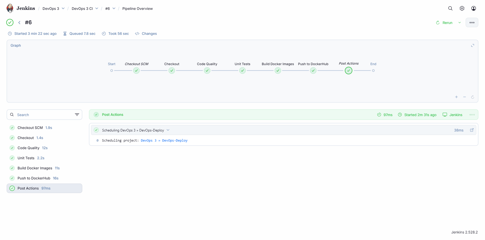
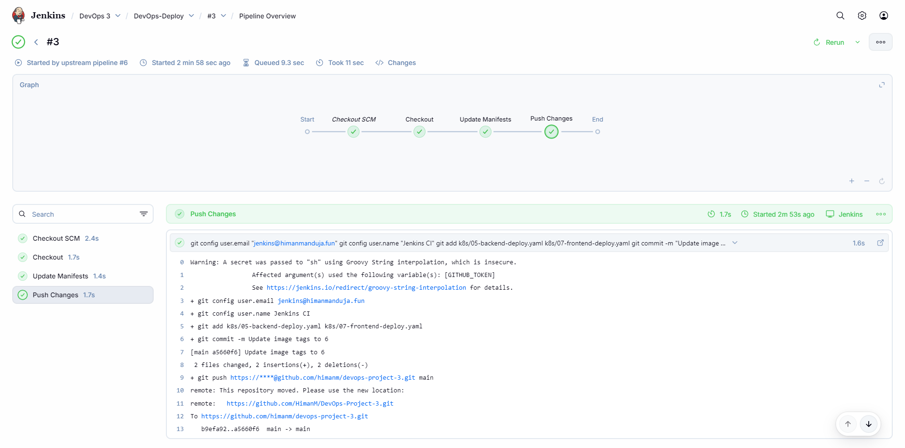
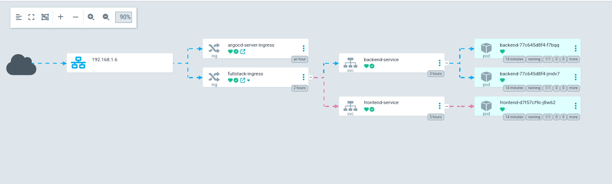
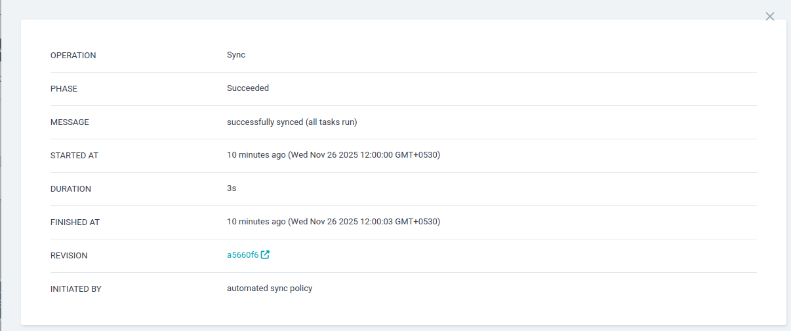
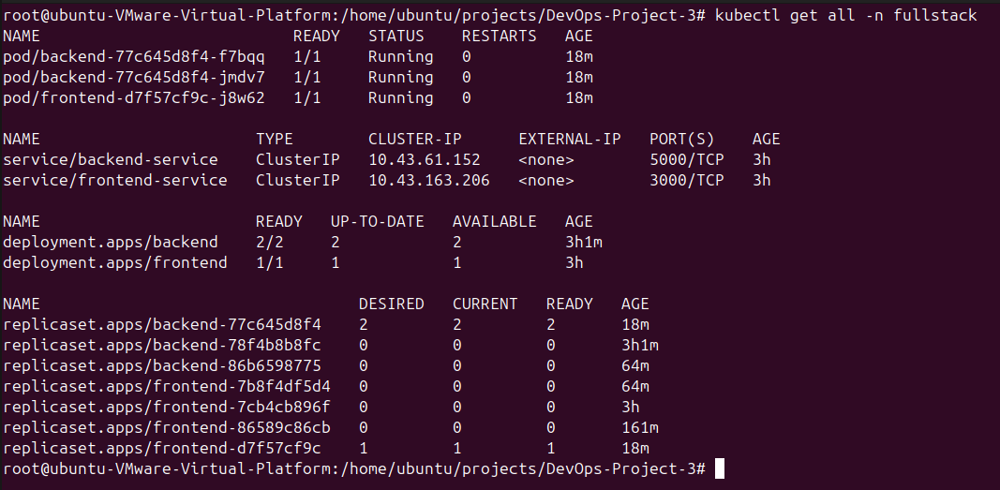

# DevOps Project 3: Full-Stack GitOps Deployment

> **A hands-on GitOps implementation demonstrating modern DevOps practices with Kubernetes, Jenkins, and ArgoCD**

## Description

This project demonstrates a complete **GitOps** workflow for deploying a full-stack application on Kubernetes. It showcases how to implement Continuous Integration and Continuous Deployment (CI/CD) using industry-standard tools. The project uses **Jenkins** for building and testing code, **ArgoCD** for declarative GitOps deployments, and **K3s** as a lightweight Kubernetes distribution. The application consists of a Next.js frontend and a Python Flask backend, deployed and managed entirely through Git as the single source of truth.

---

## Table of Contents

1.  [About This Project](#about-this-project)
2.  [Technologies Used](#technologies-used)
3.  [Techniques & Concepts](#techniques--concepts)
4.  [Architecture](#architecture)
5.  [Prerequisites](#prerequisites)
6.  [Getting Started](#getting-started)
7.  [Setup Instructions](#setup-instructions)
    *   [Installing K3s](#installing-k3s)
    *   [Installing Jenkins](#installing-jenkins)
    *   [Installing ArgoCD](#installing-argocd)
8.  [Configuration Guide](#configuration-guide)
    *   [Jenkins Configuration](#jenkins-configuration)
    *   [ArgoCD Configuration](#argocd-configuration)
9.  [Deployment Workflow](#deployment-workflow)
10. [Verification](#verification)
11. [Screenshots/Visual Reference](#screenshotsvisual-reference)
12. [License](#license)
13. [Author](#author)

---

## About This Project

This project is built for **learning DevOps and GitOps** with real-world, hands-on tools and practices. It provides a complete reference implementation for anyone looking to understand how modern cloud-native applications are deployed and managed in production environments.

**Key Learning Objectives:**
- Understand GitOps principles and workflow
- Learn Kubernetes deployment patterns
- Implement CI/CD pipelines with Jenkins
- Master declarative configuration management with ArgoCD
- Practice Infrastructure as Code (IaC) principles
- Work with containerized applications using Docker

This project is ideal for DevOps engineers, SREs, and developers who want to gain practical experience with cloud-native technologies and GitOps methodologies.

---

## Technologies Used


---

## Techniques & Concepts

This project demonstrates the following DevOps and GitOps techniques:

- **GitOps** - Using Git as the single source of truth for declarative infrastructure and applications
- **Continuous Integration (CI)** - Automated building and testing of code changes
- **Continuous Deployment (CD)** - Automated deployment to Kubernetes based on Git state
- **Declarative Configuration** - Managing infrastructure and applications through YAML manifests
- **Infrastructure as Code (IaC)** - Version-controlled infrastructure definitions
- **Container Orchestration** - Managing containerized applications with Kubernetes
- **Rolling Updates** - Zero-downtime deployments with Kubernetes rolling update strategy
- **Webhook Integration** - Automated pipeline triggers based on Git events
- **Image Versioning** - Automated Docker image tagging based on build numbers
- **Secrets Management** - Secure handling of credentials in CI/CD pipelines

---

## Architecture

This project implements a **GitOps workflow** where Git is the single source of truth for both application code and infrastructure configuration.

**GitOps Workflow:**

1. **Code Repository**: Developers push code changes to the GitHub repository
2. **CI Pipeline (Jenkins)**: 
   - Automatically triggered on code commits via webhooks
   - Runs linting and unit tests to ensure code quality
   - Builds Docker images for frontend and backend
   - Tags images with unique build numbers
   - Pushes images to DockerHub registry
3. **CD Pipeline (Jenkins)**:
   - Triggered automatically after successful CI pipeline
   - Updates Kubernetes manifest files with new image tags
   - Commits and pushes manifest changes back to Git
4. **GitOps Sync (ArgoCD)**:
   - Continuously monitors the Git repository for changes
   - Detects updates to Kubernetes manifests
   - Automatically synchronizes the cluster state to match Git
   - Performs rolling updates of application pods
5. **Kubernetes Cluster (K3s)**:
   - Hosts the application workloads
   - Manages service discovery and load balancing
   - Provides ingress routing for external access

**Component Architecture:**
- **Frontend**: Next.js application (React-based) serving the user interface
- **Backend**: Python Flask REST API handling data operations
- **Ingress**: Nginx or Traefik for routing external traffic to services
- **Persistent Storage**: PersistentVolumeClaim for backend data

---

## Prerequisites

Before starting this project, ensure you have the following:

### Required:
- **Linux Server** - Ubuntu 20.04+ or similar distribution (can be a VM, cloud instance, or bare metal)
- **Root/Sudo Access** - Administrative privileges on your server
- **Minimum Resources** - 2 CPU cores, 4GB RAM, 20GB disk space
- **Docker** - For building container images (usually included with K3s)
- **Git** - For cloning the repository and version control
- **DockerHub Account** - For storing container images (free account is sufficient)
- **GitHub Account** - For hosting your fork of the repository

### Optional:
- **Domain Name** - Only required if you want to use Ingress with a custom domain (not needed for NodePort access)
- **Ingress Controller** - Choose between Traefik (included with K3s) or Nginx (requires separate installation)

### Knowledge Prerequisites:
- Basic understanding of Linux command line
- Familiarity with Docker and containers
- Basic knowledge of Kubernetes concepts (pods, services, deployments)
- Understanding of CI/CD principles

---

## Getting Started

To replicate this project in your own environment, follow these steps:

### 1. Fork and Clone the Repository

First, fork this repository to your own GitHub account, then clone it:

```bash
# Clone the repository (replace with your fork URL)
git clone https://github.com/<YOUR-USERNAME>/DevOps-Project-3.git
cd DevOps-Project-3
```

### 2. Review the Project Structure

```
DevOps-Project-3/
├── frontend/          # Next.js frontend application
├── backend/           # Flask backend API
├── k8s/              # Kubernetes manifest files
├── docs/             # Documentation and screenshots
├── Jenkinsfile       # CI pipeline definition
└── Jenkinsfile.deploy # CD pipeline definition
```

### 3. Update Configuration Files

Before deploying, update the following files with your information:

- `k8s/argocd-application.yaml` - Update the `repoURL` with your GitHub repository URL
- `Jenkinsfile` and `Jenkinsfile.deploy` - Verify DockerHub username matches your credentials
- `k8s/nginx-ingress.yaml` or `k8s/traefik-ingress.yaml` - Update domain names if using Ingress

### 4. Prepare Your Server

Ensure your Linux server is updated and ready:

```bash
# Update system packages
sudo apt update && sudo apt upgrade -y

# Install basic utilities
sudo apt install -y curl wget git
```

Now proceed to the [Setup Instructions](#setup-instructions) to install K3s, Jenkins, and ArgoCD.

---

## Setup Instructions

This section guides you through installing all the necessary components for the GitOps workflow.

### Installing K3s

K3s is a lightweight, certified Kubernetes distribution perfect for development and edge computing. It uses less than 512MB of RAM and provides a fully compliant Kubernetes cluster.

**Step 1: Install K3s**

```bash
curl -sfL https://get.k3s.io | sh -
```

**What this does:**
- Downloads and installs K3s with default settings
- Automatically starts the K3s service
- Installs `kubectl` command-line tool
- Includes Traefik as the default ingress controller
- Sets up a local container runtime (containerd)

**Step 2: Verify Installation**

```bash
sudo kubectl get nodes
```

**Expected output:** You should see your node listed with status `Ready`

```
NAME        STATUS   ROLES                  AGE   VERSION
your-node   Ready    control-plane,master   30s   v1.28.x+k3s1
```

**Step 3: Configure kubectl Access (Without Sudo)**

```bash
# Create .kube directory for the current user
mkdir -p ~/.kube

# Copy the K3s kubeconfig file to your user directory
sudo cp /etc/rancher/k3s/k3s.yaml ~/.kube/config

# Change ownership to your user so you can access it
sudo chown $(id -u):$(id -g) ~/.kube/config

# Export KUBECONFIG environment variable (optional, add to ~/.bashrc for persistence)
export KUBECONFIG=~/.kube/config
```

**What this does:**
- Copies the Kubernetes configuration file to your home directory
- Allows you to run `kubectl` commands without `sudo`
- Sets up authentication credentials for accessing the cluster

**Step 4: Verify kubectl Access**

```bash
# Test kubectl access (without sudo)
kubectl get nodes
kubectl get pods -A
```

> [!NOTE]
> K3s comes with Traefik ingress controller by default. If you prefer Nginx, see the optional section below.

### Installing Nginx Ingress Controller (Optional)

> [!NOTE]
> This section is optional. K3s includes Traefik by default, which works well for most use cases. Only install Nginx if you specifically need it or prefer it over Traefik.

**Step 1: Install Helm (if not already installed)**

```bash
# Download and install Helm
curl https://raw.githubusercontent.com/helm/helm/main/scripts/get-helm-3 | bash
```

**What this does:**
- Installs Helm 3, the Kubernetes package manager
- Helm simplifies deploying complex applications to Kubernetes

**Step 2: Add Nginx Ingress Helm Repository**

```bash
# Add the official Nginx ingress repository
helm repo add ingress-nginx https://kubernetes.github.io/ingress-nginx

# Update repository index
helm repo update
```

**What this does:**
- Adds the official Nginx ingress Helm chart repository
- Updates the local cache of available charts

**Step 3: Install Nginx Ingress Controller**

```bash
# Install Nginx ingress in its own namespace
helm install ingress-nginx ingress-nginx/ingress-nginx \
  --namespace ingress-nginx \
  --create-namespace
```

**What this does:**
- Deploys Nginx ingress controller to the cluster
- Creates a dedicated namespace `ingress-nginx`
- Sets up a LoadBalancer service (or NodePort depending on your environment)

**Step 4: Disable Traefik (Optional)**

If you want Nginx to be the primary ingress controller and avoid port conflicts:

```bash
# Stop K3s service
sudo systemctl stop k3s

# Reinstall K3s without Traefik
curl -sfL https://get.k3s.io | sh -s - --disable traefik

# Verify K3s is running
sudo systemctl status k3s
```

**What this does:**
- Reinstalls K3s with Traefik disabled
- Prevents port conflicts between Traefik and Nginx
- Allows Nginx to use standard HTTP (80) and HTTPS (443) ports

**Step 5: Verify Nginx Installation**

```bash
# Check if Nginx pods are running
kubectl get pods -n ingress-nginx

# Check the ingress controller service
kubectl get svc -n ingress-nginx
```

### Installing Jenkins

Jenkins will serve as our CI/CD automation server, handling code builds, tests, and deployments. It can be installed on Kubernetes, Docker, or as a standalone application. This guide covers Kubernetes deployment.

**Step 1: Create Jenkins Namespace**

```bash
# Create a dedicated namespace for Jenkins
kubectl create namespace jenkins
```

**What this does:**
- Creates an isolated namespace for Jenkins resources
- Helps organize and manage Jenkins-related components

**Step 2: Add Jenkins Helm Repository**

```bash
# Add the official Jenkins Helm repository
helm repo add jenkins https://charts.jenkins.io

# Update Helm repository index
helm repo update
```

**What this does:**
- Adds the official Jenkins Helm chart repository
- Ensures you have access to the latest Jenkins charts

**Step 3: Install Jenkins**

```bash
# Install Jenkins using Helm
helm install jenkins jenkins/jenkins \
  --namespace jenkins \
  --set controller.serviceType=NodePort \
  --set controller.nodePort=30080
```

**What this does:**
- Deploys Jenkins to your Kubernetes cluster
- Uses NodePort service type for easy access (port 30080)
- Creates persistent storage for Jenkins data
- Installs Jenkins with default plugins

> [!NOTE]
> The installation may take 2-3 minutes as Jenkins initializes and downloads plugins.

**Step 4: Retrieve Initial Admin Password**

```bash
# Get the Jenkins admin password
kubectl exec --namespace jenkins -it svc/jenkins -c jenkins -- \
  /bin/cat /var/jenkins_home/secrets/initialAdminPassword
```

**What this does:**
- Retrieves the auto-generated admin password needed for first-time setup
- This password is stored inside the Jenkins container

**Step 5: Access Jenkins UI**

```bash
# Get your node's IP address
kubectl get nodes -o wide

# Access Jenkins at: http://<NODE-IP>:30080
```

**What this does:**
- Opens Jenkins web interface for configuration
- Use the admin password from Step 4 to unlock Jenkins

**Step 6: Complete Jenkins Setup Wizard**

1. Navigate to `http://<NODE-IP>:30080` in your browser
2. Enter the admin password retrieved in Step 4
3. Select **"Install suggested plugins"**
4. Create an admin user account
5. Configure Jenkins URL (use your server IP or domain)
6. Start using Jenkins

> [!IMPORTANT]
> For production environments, consider using Ingress with HTTPS instead of NodePort, and configure proper authentication and authorization.

### Installing ArgoCD

ArgoCD is a declarative GitOps continuous delivery tool for Kubernetes. It monitors your Git repository and automatically synchronizes the cluster state to match your configuration files.

**Step 1: Create ArgoCD Namespace**

```bash
# Create a dedicated namespace for ArgoCD
kubectl create namespace argocd
```

**What this does:**
- Creates an isolated namespace for all ArgoCD components
- Separates ArgoCD resources from application workloads

**Step 2: Install ArgoCD**

```bash
# Install ArgoCD using the official manifest
kubectl apply -n argocd -f https://raw.githubusercontent.com/argoproj/argo-cd/stable/manifests/install.yaml
```

**What this does:**
- Deploys all ArgoCD components (API server, repo server, application controller, etc.)
- Creates necessary services and deployments
- Sets up role-based access control (RBAC)

**Step 3: Wait for ArgoCD to be Ready**

```bash
# Watch ArgoCD pods until all are running
kubectl wait --for=condition=Ready pods --all -n argocd --timeout=300s

# Verify all pods are running
kubectl get pods -n argocd
```

**What this does:**
- Waits for all ArgoCD components to initialize
- Verifies the installation was successful

**Step 4: Install ArgoCD CLI (Optional but Recommended)**

```bash
# Download the latest ArgoCD CLI
curl -sSL -o argocd-linux-amd64 https://github.com/argoproj/argo-cd/releases/latest/download/argocd-linux-amd64

# Install the CLI to /usr/local/bin
sudo install -m 555 argocd-linux-amd64 /usr/local/bin/argocd

# Remove the downloaded file
rm argocd-linux-amd64

# Verify installation
argocd version --client
```

**What this does:**
- Installs the ArgoCD command-line interface
- Allows you to manage ArgoCD from the terminal
- Useful for automation and scripting

**Step 5: Access ArgoCD UI**

```bash
# Expose ArgoCD server via port-forward (for initial setup)
kubectl port-forward svc/argocd-server -n argocd 8080:443 &

# Or expose via NodePort (for persistent access)
kubectl patch svc argocd-server -n argocd -p '{"spec": {"type": "NodePort"}}'
```

**What this does:**
- Makes the ArgoCD web interface accessible
- Port-forward: temporary access at https://localhost:8080
- NodePort: persistent access at https://<NODE-IP>:<NODE-PORT>

**Step 6: Retrieve Admin Password**

```bash
# Get the initial admin password
kubectl -n argocd get secret argocd-initial-admin-secret \
  -o jsonpath="{.data.password}" | base64 -d; echo
```

**What this does:**
- Retrieves the auto-generated admin password
- This password is required for first-time login

**Step 7: Login to ArgoCD**

```bash
# Login using CLI (optional)
argocd login <ARGOCD-SERVER>:443 --username admin --password <PASSWORD> --insecure

# Or access the UI at https://localhost:8080 (if using port-forward)
# Username: admin
# Password: <password from step 6>
```

> [!IMPORTANT]
> After logging in for the first time, change the admin password using the ArgoCD UI or CLI:
> ```bash
> argocd account update-password
> ```

---

## Configuration Guide

After installing all the tools, we need to configure Jenkins and ArgoCD to work together in the GitOps workflow.

### Jenkins Configuration

Jenkins requires credentials for DockerHub (to push images) and GitHub (to update manifests).

#### Step 1: Configure Jenkins Credentials

Navigate to **Manage Jenkins** > **Credentials** > **System** > **Global credentials (unrestricted)** > **Add Credentials**

**A. DockerHub Credentials**

These credentials allow Jenkins to push Docker images to your DockerHub registry.

- **Kind**: Username with password
- **Scope**: Global
- **Username**: Your DockerHub username
- **Password**: Your DockerHub password or access token
- **ID**: `dockerhub-username` (must match exactly as used in Jenkinsfile)
- **Description**: DockerHub credentials for pushing images


**B. GitHub Personal Access Token**

This token allows Jenkins to push manifest updates back to your GitHub repository.

1. Generate a GitHub Personal Access Token:
   - Go to GitHub Settings > Developer settings > Personal access tokens > Tokens (classic)
   - Click "Generate new token (classic)"
   - Give it a descriptive name (e.g., "Jenkins GitOps Token")
   - Select scopes: `repo` (Full control of private repositories)
   - Generate and copy the token

2. Add to Jenkins:
   - **Kind**: Secret text
   - **Scope**: Global
   - **Secret**: Paste your GitHub Personal Access Token
   - **ID**: `github-token` (must match exactly as used in Jenkinsfile.deploy)
   - **Description**: GitHub token for updating manifests


#### Step 2: Install Required Jenkins Plugins

Navigate to **Manage Jenkins** > **Plugins** > **Available plugins**

Install the following plugins if not already installed:
- **Docker Pipeline** - For building and pushing Docker images
- **Git** - For Git repository access
- **Pipeline** - For pipeline functionality
- **Credentials Binding** - For using credentials in pipelines

After installation, restart Jenkins if required.

#### Step 3: Create Jenkins Pipelines

**A. Build Pipeline (CI Pipeline)**

This pipeline handles code building, testing, and Docker image creation.

1. Click **New Item** from Jenkins dashboard
2. Enter name: `DevOps-Build`
3. Select **Pipeline** and click OK
4. Under **Pipeline** section:
   - **Definition**: Pipeline script from SCM
   - **SCM**: Git
   - **Repository URL**: `https://github.com/<YOUR-USERNAME>/DevOps-Project-3.git` (use your fork)
   - **Branch Specifier**: `*/main`
   - **Script Path**: `Jenkinsfile`
5. Under **Build Triggers** (optional):
   - Check **GitHub hook trigger for GITScm polling** (if using webhooks)
6. Click **Save**

**B. Deploy Pipeline (CD Pipeline)**

This pipeline updates Kubernetes manifests with new image tags.

1. Click **New Item** from Jenkins dashboard
2. Enter name: `DevOps-Deploy`
3. Select **Pipeline** and click OK
4. Check **This project is parameterized**
   - Click **Add Parameter** > **String Parameter**
   - **Name**: `IMAGE_TAG`
   - **Default Value**: `latest`
   - **Description**: Docker image tag to deploy
5. Under **Pipeline** section:
   - **Definition**: Pipeline script from SCM
   - **SCM**: Git
   - **Repository URL**: `https://github.com/<YOUR-USERNAME>/DevOps-Project-3.git` (use your fork)
   - **Branch Specifier**: `*/main`
   - **Script Path**: `Jenkinsfile.deploy`
6. Click **Save**

> [!NOTE]
> The Build pipeline automatically triggers the Deploy pipeline on success, passing the build number as the IMAGE_TAG parameter.

### ArgoCD Configuration

ArgoCD needs to be connected to your Git repository to monitor and sync Kubernetes manifests.

#### Step 1: Update ArgoCD Application Manifest

Before creating the ArgoCD application, update the repository URL in the manifest:

```bash
# Edit the ArgoCD application manifest
nano k8s/argocd-application.yaml
```

Update the `repoURL` field to point to your forked repository:

```yaml
spec:
  source:
    repoURL: https://github.com/<YOUR-USERNAME>/DevOps-Project-3.git  # Update this
    targetRevision: main
    path: k8s
```

**What this does:**
- Points ArgoCD to your Git repository
- Specifies which branch to monitor (main)
- Indicates which directory contains Kubernetes manifests (k8s)

#### Step 2: Create ArgoCD Application

```bash
# Apply the ArgoCD application manifest
kubectl apply -f k8s/argocd-application.yaml
```

**What this does:**
- Registers your application with ArgoCD
- Configures automatic synchronization settings
- Defines the target Kubernetes namespace for deployment

#### Step 3: Verify Application Creation

```bash
# Check ArgoCD application status via CLI
argocd app list

# Or check via kubectl
kubectl get applications -n argocd
```

**Expected output:** You should see your application listed with sync status

#### Step 4: Initial Sync

```bash
# Manually trigger initial sync
argocd app sync devops-project-3

# Or sync via kubectl
kubectl patch application devops-project-3 -n argocd \
  --type merge -p '{"operation":{"initiatedBy":{"username":"admin"},"sync":{}}}'
```

**What this does:**
- Deploys all Kubernetes resources defined in your repository
- Creates namespaces, services, deployments, and ingress resources
- Establishes the initial baseline state

#### Step 5: Enable Auto-Sync (Optional but Recommended)

The application manifest already includes auto-sync configuration, but you can verify or update it:

```yaml
spec:
  syncPolicy:
    automated:
      prune: true      # Automatically delete resources removed from Git
      selfHeal: true   # Automatically sync when cluster state drifts
    syncOptions:
      - CreateNamespace=true
```

**What this does:**
- Automatically synchronizes changes from Git to the cluster
- Removes resources deleted from Git (prune)
- Corrects manual changes to keep cluster in sync (selfHeal)

#### Step 6: Configure GitHub Webhook (Optional)

For instant synchronization when you push to Git, configure a webhook:

**A. Get ArgoCD Webhook URL**

If using Ingress:
```
https://<YOUR-ARGOCD-DOMAIN>/api/webhook
```

If using NodePort, you might need to expose the webhook endpoint differently.

**B. Configure GitHub Webhook**

1. Go to your GitHub repository
2. Navigate to **Settings** > **Webhooks** > **Add webhook**
3. Configure:
   - **Payload URL**: `https://<YOUR-ARGOCD-DOMAIN>/api/webhook`
   - **Content type**: `application/json`
   - **Secret**: (optional, can be configured in ArgoCD)
   - **SSL verification**: Enable SSL verification (if using HTTPS)
   - **Which events**: Select "Just the push event"
4. Click **Add webhook**


**What this does:**
- Notifies ArgoCD immediately when code is pushed to GitHub
- Triggers faster synchronization instead of waiting for polling interval
- Reduces deployment latency in the GitOps workflow

> [!NOTE]
> Without a webhook, ArgoCD polls the repository every 3 minutes by default. Webhooks enable instant synchronization.

---

## Deployment Workflow

This section explains the complete GitOps workflow from code commit to production deployment.

### End-to-End GitOps Flow

```
Developer → Git Push → Jenkins CI → Docker Build → Jenkins CD → Git Update → ArgoCD → Kubernetes
```

### Detailed Workflow Steps

**Step 1: Developer Pushes Code**
- Developer makes changes to application code (frontend or backend)
- Commits changes to the `main` branch
- Pushes to GitHub repository

**Step 2: GitHub Webhook Triggers Jenkins**
- GitHub webhook notifies Jenkins of the new commit
- Jenkins Build pipeline (`DevOps-Build`) is automatically triggered

**Step 3: Jenkins CI Pipeline Execution**
- **Checkout**: Clones the latest code from GitHub
- **Code Quality**: Runs ESLint on frontend code to catch syntax/style errors
- **Unit Tests**: Executes pytest on backend to verify functionality
- **Build**: Creates Docker images for both frontend and backend
  - Tags images with unique build number (e.g., `himanmanduja/devops-project-3-frontend:42`)
- **Push**: Uploads images to DockerHub registry
- **Trigger**: On success, automatically triggers the Deploy pipeline with the build number

**Step 4: Jenkins CD Pipeline Execution**
- **Checkout**: Clones the repository again to get latest manifests
- **Update Manifests**: Modifies Kubernetes deployment files:
  - Updates `k8s/05-backend-deploy.yaml` with new backend image tag
  - Updates `k8s/07-frontend-deploy.yaml` with new frontend image tag
- **Commit Changes**: Commits the manifest updates with a descriptive message
- **Push to Git**: Pushes changes back to GitHub repository

**Step 5: ArgoCD Detects Changes**
- ArgoCD continuously monitors the Git repository (every 3 minutes or via webhook)
- Detects that Kubernetes manifests have been updated
- Compares current cluster state with desired state in Git
- Identifies differences (OutOfSync status)

**Step 6: ArgoCD Synchronization**
- Automatically applies the new manifests to the cluster (if auto-sync enabled)
- Kubernetes performs rolling updates:
  - Creates new pods with updated image tags
  - Waits for new pods to be ready
  - Terminates old pods gracefully
  - Ensures zero downtime during deployment
- Updates service endpoints to route traffic to new pods

**Step 7: Application Updated**
- New version of the application is now running in production
- Cluster state matches the Git repository (Synced status)
- Changes are fully deployed and verified

### GitOps Principles Demonstrated

1. **Git as Single Source of Truth**: All infrastructure and application configurations are stored in Git
2. **Declarative Configuration**: Desired state is declared in YAML manifests, not scripted imperatively
3. **Automated Deployment**: Changes are automatically deployed without manual intervention
4. **Continuous Reconciliation**: ArgoCD ensures cluster always matches Git state
5. **Version Control**: Full audit trail of all changes with Git history
6. **Rollback Capability**: Easy rollback by reverting Git commits

### Workflow Diagram

```
┌─────────────┐
│  Developer  │
└──────┬──────┘
       │ git push
       ▼
┌─────────────────┐
│  GitHub Repo    │◄───────────────┐
└──────┬──────────┘                │
       │ webhook                   │ git push (manifest update)
       ▼                           │
┌─────────────────┐         ┌──────────────┐
│ Jenkins Build   │────────►│Jenkins Deploy│
│   (CI Pipeline) │ trigger │ (CD Pipeline)│
└─────────┬───────┘         └──────────────┘
          │
          │ docker push
          ▼
    ┌──────────┐
    │DockerHub │
    └──────────┘
          
┌─────────────────┐
│  GitHub Repo    │
│  (manifests)    │
└──────┬──────────┘
       │ git poll / webhook
       ▼
┌─────────────────┐
│     ArgoCD      │
└──────┬──────────┘
       │ kubectl apply
       ▼
┌─────────────────┐
│  Kubernetes     │
│  Cluster (K3s)  │
└─────────────────┘
```

---

## Verification

After completing the setup and triggering a deployment, verify that everything is working correctly.

### Step 1: Verify Jenkins Pipelines

**Check Build Pipeline:**
```bash
# Access Jenkins UI and navigate to DevOps-Build pipeline
# You should see successful build execution with these stages:
# [Success] Checkout
# [Success] Code Quality
# [Success] Unit Tests
# [Success] Build Docker Images
# [Success] Push to DockerHub
```

**Check Deploy Pipeline:**
```bash
# Navigate to DevOps-Deploy pipeline
# You should see successful deployment with these stages:
# [Success] Checkout
# [Success] Update Kubernetes Manifests
# [Success] Commit and Push Changes
```

### Step 2: Verify Docker Images

```bash
# Check that images were pushed to DockerHub
# Visit: https://hub.docker.com/r/<YOUR-USERNAME>/devops-project-3-frontend
# Visit: https://hub.docker.com/r/<YOUR-USERNAME>/devops-project-3-backend

# Or use Docker CLI
docker pull <YOUR-USERNAME>/devops-project-3-frontend:<BUILD-NUMBER>
docker pull <YOUR-USERNAME>/devops-project-3-backend:<BUILD-NUMBER>
```

### Step 3: Verify ArgoCD Application

```bash
# Check application status via CLI
argocd app get devops-project-3

# Expected output should show:
# Health Status: Healthy
# Sync Status: Synced

# Check via kubectl
kubectl get applications -n argocd
```

### Step 4: Verify Kubernetes Resources

```bash
# Check all resources in the application namespace
kubectl get all -n devops-project-3

# Expected output:
# - deployment.apps/backend (1/1 pods ready)
# - deployment.apps/frontend (1/1 pods ready)
# - service/backend
# - service/frontend

# Check pod status
kubectl get pods -n devops-project-3

# All pods should be in "Running" state
```

### Step 5: Verify Application Connectivity

```bash
# Check service endpoints
kubectl get svc -n devops-project-3

# Test backend API
kubectl port-forward -n devops-project-3 svc/backend 5000:5000 &
curl http://localhost:5000/api/health

# Test frontend
kubectl port-forward -n devops-project-3 svc/frontend 3000:3000 &
curl http://localhost:3000
```

### Step 6: Verify Ingress (if configured)

```bash
# Check ingress resources
kubectl get ingress -n devops-project-3

# Test ingress endpoint (if using domain)
curl https://your-domain.com

# Or check with NodePort
kubectl get svc -n devops-project-3 frontend -o jsonpath='{.spec.ports[0].nodePort}'
# Access: http://<NODE-IP>:<NODE-PORT>
```

### Step 7: Check Application Logs

```bash
# Backend logs
kubectl logs -n devops-project-3 -l app=backend --tail=50

# Frontend logs
kubectl logs -n devops-project-3 -l app=frontend --tail=50

# ArgoCD application controller logs (for troubleshooting sync issues)
kubectl logs -n argocd -l app.kubernetes.io/name=argocd-application-controller --tail=50
```

### Step 8: Test End-to-End Deployment

To verify the complete GitOps workflow:

1. Make a small change to the application code (e.g., update a text string)
2. Commit and push to GitHub
3. Watch Jenkins Build pipeline execute automatically
4. Verify Docker images are built and pushed
5. Watch Jenkins Deploy pipeline trigger automatically
6. Verify manifests are updated in Git
7. Watch ArgoCD detect changes and sync
8. Verify new pods are deployed with updated images
9. Confirm application shows your changes

### Troubleshooting Common Issues

**Jenkins Build Fails:**
- Check Jenkins credentials are configured correctly
- Verify Docker daemon is accessible
- Check network connectivity to GitHub and DockerHub

**ArgoCD OutOfSync:**
- Verify repository URL in argocd-application.yaml is correct
- Check ArgoCD has network access to GitHub
- Manually trigger sync: `argocd app sync devops-project-3`

**Pods Not Starting:**
- Check image pull secrets if using private registry
- Verify image tags in deployment manifests are correct
- Check pod logs: `kubectl logs -n devops-project-3 <pod-name>`

**Ingress Not Working:**
- Verify ingress controller is installed and running
- Check DNS records point to correct IP
- Verify ingress rules match service names and ports

---

## Screenshots/Visual Reference

This section provides visual references for each component of the GitOps workflow.

### Application Landing Page

The deployed full-stack application with frontend and backend integrated.



### GitHub Configuration

**Webhook Configuration**

GitHub webhook setup to trigger Jenkins pipelines automatically on code push.


### Jenkins Configuration

**Pipelines Overview**

Dashboard showing both CI and CD pipelines configured for the project.



**CI Pipeline Execution**

The Build pipeline executing all stages: checkout, code quality checks, unit tests, Docker build, and push to DockerHub.



**CD Pipeline Execution**

The Deploy pipeline updating Kubernetes manifests with new image tags and pushing changes back to Git.



**DockerHub Credentials Configuration**

Jenkins credentials setup for authenticating with DockerHub to push container images.


**GitHub Token Credentials Configuration**

Jenkins credentials setup for GitHub Personal Access Token to update manifests in the repository.


### ArgoCD Dashboard

**Application Status**

ArgoCD application showing sync status, health status, and deployed resources.


**Application Details**

Detailed view of the ArgoCD application with all Kubernetes resources and their statuses.


**Resource Map**

Visual representation of all deployed Kubernetes resources and their relationships (pods, services, deployments).



**Synchronization Process**

ArgoCD synchronization in progress, applying changes from Git to the cluster.




### Kubernetes Cluster

**Cluster Resources**

Output of `kubectl get all` showing all deployed resources in the application namespace.



**Ingress Configuration**

Kubernetes ingress resources configured for routing external traffic to the application.


---

## License

This project is released under the **MIT License** and is **free to use** for **educational purposes**.

**You are free to:**
- Use this project for learning and educational purposes
- Fork and modify the code for your own projects
- Share and distribute this project
- Use it in commercial projects with attribution

This project was created as a learning resource for the DevOps community. The goal is to help others understand GitOps workflows and modern cloud-native development practices.

**Attribution:**
If you use this project or derive work from it, please provide appropriate credit and link back to the original repository.

---

## Author

**Himan Manduja**

DevOps Engineer passionate about cloud-native technologies, GitOps, and automation.

**Connect with me:**
- GitHub: [@HimanM](https://github.com/HimanM)
- LinkedIn: [Himan Manduja](https://www.linkedin.com/in/himan-manduja/)
- Website: [himanmanduja.fun](https://himanmanduja.fun)

**About the Project:**
This project is part of a series of DevOps learning projects designed to provide hands-on experience with real-world tools and practices. Each project builds upon fundamental concepts and introduces new technologies and methodologies.

**Feedback and Contributions:**
Contributions, issues, and feature requests are welcome! Feel free to open an issue or submit a pull request if you have suggestions for improvements.

---

> [!NOTE]
> This README follows a standardized format for all DevOps learning projects. For questions or support, please open an issue in the GitHub repository.
